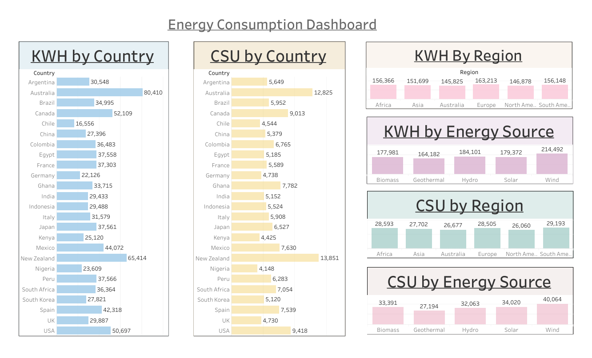

# ⚡ Global Energy Consumption & Cost Savings Dashboard

## 📖 Overview

This project analyzes global energy trends, focusing on the relationship between **Energy Consumption (KWH)** and **Cost Savings (CSU)**. Using **Tableau** for visualization and **Snowflake** for data warehousing, this dashboard provides a high-level view of renewable energy adoption and financial efficiency across different geographies.

The analysis breaks down data by **Region** (e.g., Europe, North America), **Country**, and **Energy Source** (e.g., Wind, Solar, Hydro).

## 🛠 Tech Stack

* **Data Visualization:** Tableau
* **Data Warehousing:** Snowflake
* **Data Format:** Structured Data (CSV/SQL)

## 📊 Key Features

The dashboard includes six primary visualizations to answer key business questions:

1.  **KWH by Country:** A ranking of total energy consumption by individual nations.
2.  **CSU by Country:** A financial ranking showing which countries are achieving the highest cost savings.
3.  **KWH by Region:** A comparative view of energy usage across continents.
4.  **CSU by Region:** A comparative view of cost savings across continents.
5.  **KWH by Energy Source:** Analysis of which renewable sources generate the most power.
6.  **CSU by Energy Source:** Analysis of which renewable sources generate the most financial savings.

